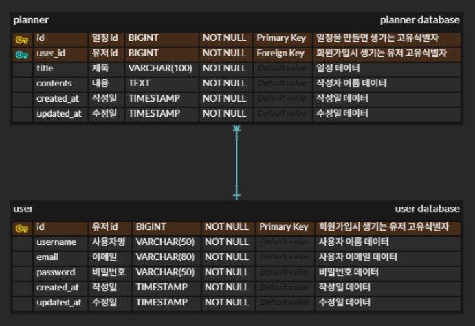

# 플래너 (일정 관리 API)

## 프로젝트 소개
Planner는 사용자가 개인 일정을 생성, 조회, 수정, 삭제할 수 있도록 도와주는 일정 관리 API 입니다.
유저는 회원가입 후 로그인하여 본인의 일정만 관리할 수 있으며, JPA를 활용한 CRUD 기능과 로그인 인증 기능을 포함하고 있습니다.

---

## 사용 기술
- **Backend**: Spring Boot, Spring MVC, Spring Data JPA
- **Language**: Java 17
- **Build Tool**: Gradle
- **Database**: MySQL
- **Templating Engine**: Thymeleaf
- **Utilities**: Lombok

---

## 기능

## 유저

### 유저 생성

- 유저 생성 /users
- 유저명
- 이메일
- 패스워드
- 작성일(자동 생성, 날짜와 시간 포함)
- 수정일(최초만 작성일과 동일 수정 후에 자동 생성)
- 각 유저는 고유 식별자(id)가 자동으로 생성됨

### 특정 유저 조회

- 조회 /users/{id}

### 유저 수정

- 수정 /users/{id}
- 수정 가능한 항목(유저명, 이메일, 패스워드)
- 작성일은 변경 불가
- 수정일은 수정 후 자동 업데이트

### 유저 삭제

- 삭제 /users/{id}

## 로그인

### 로그인

- /sign/login

### 로그아웃

- /sign/logout

## 일정

### 일정 생성

- 생성 /plans
- 할일 (내용)
- 작성자
- 비밀번호
- 작성일(자동 생성, 날짜와 시간 포함)
- 수정일(최초만 작성일과 동일 수정 후에 자동 생성)
- 각 일정은 고유 식별자(id)가 자동으로 생성됨

### 전체 일정 조회

- 조회 /plans

### 선택 일정 조회

- 조회 /plans/{id}

### 일정 수정

- 수정 /plans/{id}
- 수정 가능한 항목(제목, 할일)
- 작성일은 변경 불가
- 수정일은 수정 후 자동 업데이트

### 일정 삭제

- 삭제 /plans/{id}

---
## ERD

---

## API 명세서
### 일정 CRUD

|       | HTTP Method | URL | Path Variable | Request Parameter | Request Body(dto)                                                                               | Response                                                                                                                                                                                                                                                                                                                                                      | HTTP 상태 코드 |
|-------|------------|-----|---------------|-------------------|-------------------------------------------------------------------------------------------------|---------------------------------------------------------------------------------------------------------------------------------------------------------------------------------------------------------------------------------------------------------------------------------------------------------------------------------------------------------------|------------|
| 일정 생성 | POST       |/plans| X             | X                 | <pre>{     “title”: “제목”,     “contents”: “할 일” }</pre> | <pre>{     “id”: 1,     “user_id”: 1,     “title”: “제목”,      “contents”: “할일”,      “created_at”: “작성일”,      “updated_at”: “수정일”  }</pre>                                                                                                                                                                                   | 201: 정상 등록   401: 로그인하지 않은 사용자가 생성할 경우
|전체 일정 조회| GET        |/plans| X             | X                 | X                                                                                               | <pre>[ {     “id”: 1,     “user_id”: 1,     “title”: “제목”,      “contents”: “할일”,      “created_at”: “작성일”,      “updated_at”: “수정일”  } {      “id”: 2,     “user_id”: 1,     “title”: “제목”,      “contents”: “할일”,      “created_at”: “작성일”,      “updated_at”: “수정일”  } ]</pre> | 200: 정상 조회
|선택 일정 조회| GET        |/plans/{id}| id (Long)     | X                 | X                                                                                               | <pre>{     “id”: 1,     “user_id”: 1,     “title”: “제목”,      “contents”: “할일”,      “created_at”: “작성일”,      “updated_at”: “수정일”  }</pre>                                                                                                                                                                                   | 200: 정상 조회 
|일정 수정| PATCH  |/plans/{id}| id (Long)| X                 | <pre>{     “title”: “수정한 제목”,      “contents”: “수정한 일정”,  }</pre>                   | <pre>{     “id”: 1,     “user_id”: 1,     “title”: “수정된 제목”,     “contents”: “수정된 일정”,      “created_at”: “작성일”,     “update_at”: “수정일” }</pre>                                                                                                                                                                                                   |200: 정상 수정  401: 로그인하지 않은 사용자가 수정할 경우
|일정 삭제|DELETE|/plans/{id}|id (Long)| X                 | X                                                                                               | <pre>{     “msg”: “일정 삭제 완료!” }</pre>                                                                                                                                                                                                                                                                                                                 | 200: 정상 삭제   401: 로그인하지 않은 사용자가 삭제할 경우                                                                                                                                                                                                                                                                

 

### 유저 CRUD

|          | HTTP Method | URL         | Path Variable | Request Parameter | Request Body(dto)                                                                                     | Response                                                                                                                                                                                                                                                                                                           | HTTP 상태 코드 |
|----------|-------|-------------|---------------|-------------------|-------------------------------------------------------------------------------------------------------|--------------------------------------------------------------------------------------------------------------------------------------------------------------------------------------------------------------------------------------------------------------------------------------------------------------------|------------|
| 회원가입     | POST  | /users      | X             | X                 | <pre>{     “username”: “김태정”,      “email”: “...”,      “password”: “1234” }</pre>    | <pre>{     “id”: 1,      “username”: “김태정”,      “email”: “...”,      “created_at”: “작성일”,      “updated_at”: “수정일”  }</pre>                                                                                                                                                             | 201: 정상 등록
| 특정 유저 조회 | GET   | /users/{id} | id (Long)     | X                 | X                                                                                                     | <pre>{     “id”: 1,      “username”: “김태정”,      “email”: “...”,      “created_at”: “작성일”,      “updated_at”: “수정일”  }</pre>                                                                                                                                                             | 200: 정상 조회 
| 유저 정보 수정 | PATCH | /users/{id} | id (Long)| X                 | <pre>{     “username”: “수정한 이름”,      “email”: “...”,      “password”: “1234" }</pre> | <pre>{     “id”: 1,      “username”: “수정한 이름”,      “email”: “...”,      “created_at”: “작성일”,      “updated_at”: “수정일”  }</pre>                                                                                                                                                          |200: 정상 수정
| 유저 삭제    | DELETE | /users/{id} |id (Long)| X                 | X                                                                                                     | <pre>{     “msg”: “일정 삭제 완료!” }</pre>                                                                                                                                                                                                                                                                      | 200: 정상 삭제                                                                                                                                                                                                                                                                 

 

### 로그인

|      | HTTP Method | URL          | Path Variable | Request Parameter | Request Body(dto)                                                                                     | Response                                             | HTTP 상태 코드 |
|------|-------------|--------------|---------------|-------------------|-------------------------------------------------------------------------------------------------------|------------------------------------------------------|------------|
| 로그인  | POST        | /sign/login  | X             | X                 | <pre>{      “email”: “...”,      “password”: “1234” }</pre>    | <pre>{     “message”: “로그인 성공!!”    }</pre>  | 200: 정상 코드    401: 이메일 또는 비밀번호가 틀렸을 때 에러 코드
| 로그아웃 | POST        | /sign/logout | X             | X                 | X                                                                                                     | <pre>{     “message”: “로그아웃 성공!!”    }</pre> | 200: 정상 코드

---
## 프로젝트 작성자
이 프로젝트는 **김태정**이 개발하였습니다.  
🔗 [김태정 GitHub](https://github.com/xaehub)